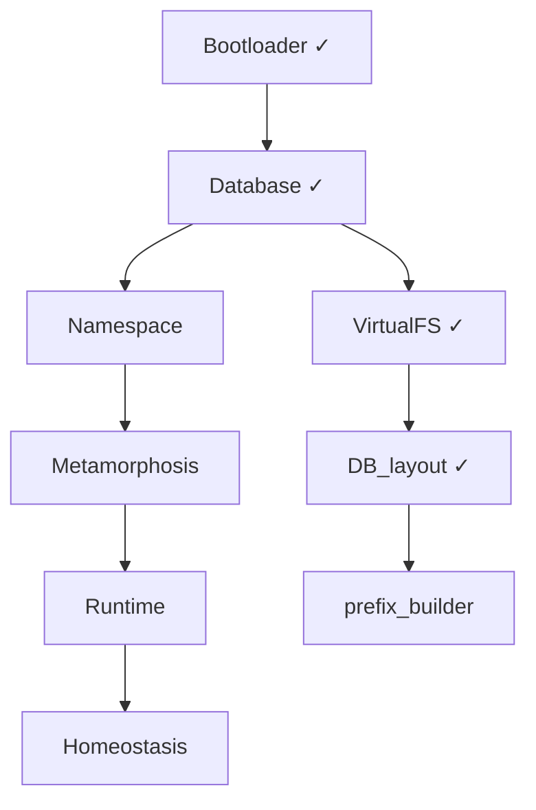

```mermaid
flowchart TD
    %% High-level conceptual chain
    A[Bootloader ✓] --> B[Database ✓] --> D[Namespace] --> E[Metamorphosis] --> F[Runtime] --> G[Homeostasis]

    %% Concrete sequence from DB_bootloader.py
    V[VirtualFS ✓] --> L[DB_layout ✓] --> P[prefix_builder]
    %% Cross-link 
    B --> V
```

Know unknowns (not sure exact path to make them work): prefix_builder, connections