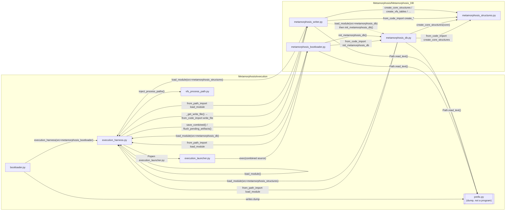

Control flow is only among the execution harness and the four Metamorphosis_DB modules. The graph below is those programs and the actual calls/execs between them — not namespace or egg.

24 edges

How to read it:

- **Solid edges** are the live boot path. **Dotted** is writer `__main__` self-test only.
- `bootloader.py` is the only program that *receives* the prefix as an argument. Everyone else either gets it prepended into source (`exec`) or re-reads the dump to pass into `load_module`.
- `execution_harness.py` sits in the middle of almost every edge. Domain modules do not import each other as files; they ask the harness to assemble a child, then `from_code_import` a symbol and call it.
- `metamorphosis_structures.py` is a leaf: it is only assembled and called. It never reads `prefix.py` and never calls back into execution.
- `vfs_process_path.py` is only used by the harness during assembly, not by the DB modules.
- The harness → writer edge is the persistence side-path (`save_combined` / flush). It is also why writer load is re-entrancy-guarded: writer top-level itself calls `load_module(structures)`.

The repeating triangle on the DB side is the surface a `prefix=` kwarg would have to cover: **mboot → harness → mdb → harness → structs**, and independently **harness → writer → harness → structs**.