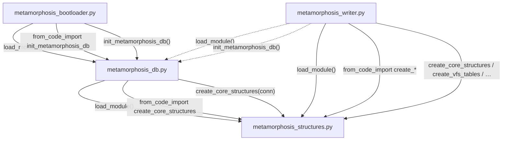

Four programs, no execution nodes. Harness helpers show up only as edge labels between these files.

**11 edges** among **4 nodes**: 9 live, 2 dotted self-test.

What this collapses: `from_path_import load_module` is not an extra node now. It is the same `load_module()` edges. `prefix.py` / launcher / `inject_process_paths` are outside this box.

What is still true inside the box:

- `metamorphosis_structures.py` is only a callee.
- `metamorphosis_bootloader.py` never talks to writer or structures directly.
- Writer and db both assemble structures independently. They do not call each other on the boot path.
- The repeating triple on each solid pair is one real hop told three times: assemble via borrowed `load_module`, extract a symbol, call it.