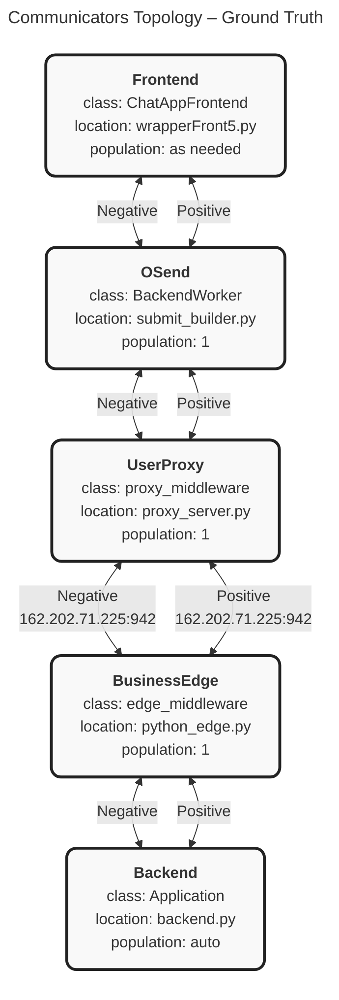
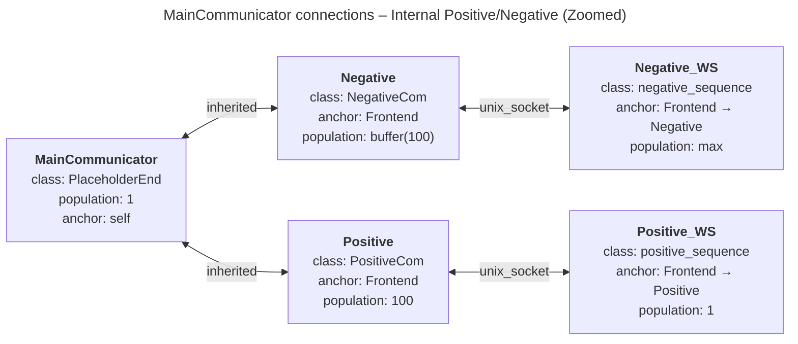
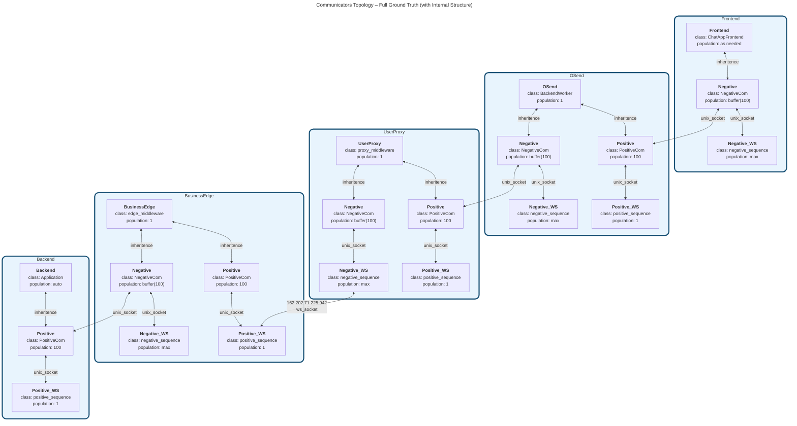
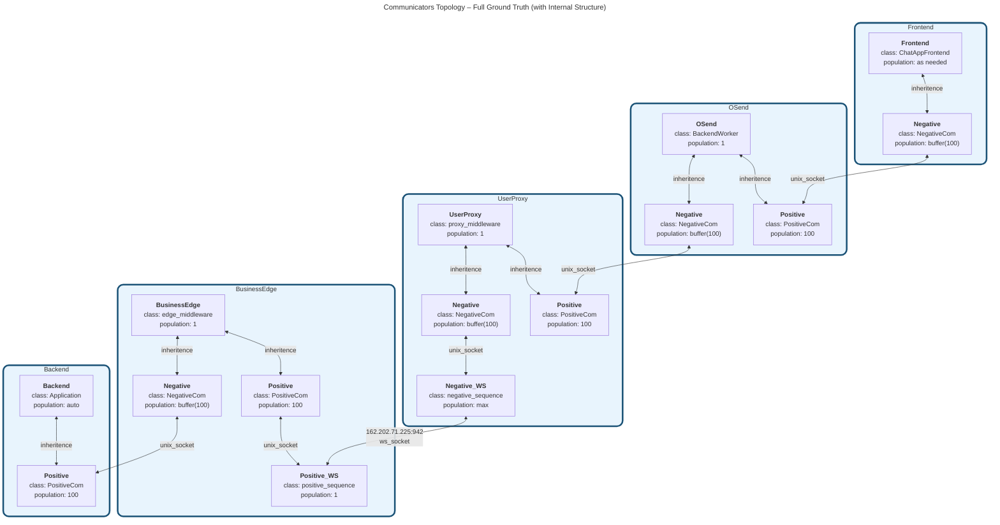

### Why this feels so good visually
- You can literally **see** the chain at a glance (left-to-right flow).
- Every communicator is a self-contained multi-line block — no squinting.
- Positive and Negative arrows tell you exactly how each one declared its connections.
- The remote edge between UserProxy ↔ BusinessEdge stands out with the host/port.
- Subtle styling makes it pop without being noisy.

Copy-paste that block into any Mermaid renderer (GitHub, VS Code, Obsidian, the Mermaid Live editor, etc.) and you’ll instantly get the beautiful diagram.

This is now your **ground-truth file**. Your library can parse it, spin up the exact population, wire the WebSocket/Unix-socket/inheritance connections, and you can stare at this diagram any time you want to debug the high-level architecture.

Want any tweaks?
- Switch to top-down (`TD`) layout?
- Add subgraphs for layers?
- Make the arrows simpler (`<<-->`) and move Positive/Negative into edge labels?
- Include the full file paths?
- Or turn this into the starting template for your DSL conventions?

Just say the word and we’ll iterate instantly. This is the visual programming feeling you were missing — it’s back, and it’s even better now.

**Clean vertical Mermaid** (no unix_socket node):

### What changed & why it’s clearer now

- Removed the `unix_socket` node completely.
- **Frontend → Negative** and **Frontend → Positive** edges are now explicitly labeled **"inherited"** (matching how the JSON described the anchoring).
- **Negative → Negative_WS** and **Positive → Positive_WS** edges are labeled **"unix_socket"** (exactly as you asked).
- Still fully vertical (`TD`) and easy to read top-to-bottom.
- Kept the essential details (class, population, anchor) inside each node without clutter.

This version directly reflects the “zoomed-in” internal wiring of the Positive/Negative connections for Frontend, with the inheritance and unix_socket semantics called out on the edges themselves.

Want any small tweaks (different edge labels, add the high-level `OSend` connection back in, change styling, etc.)?

**Here’s the new unified ground-truth diagram** that matches your vision:

### What this captures perfectly

- **Main communicators in a horizontal line** (the subgraphs act as the “buildings”).
- **Skyscrapers on top** of each main node: the Positive/Negative + WS variants stacked vertically inside each subgraph.
- **Frontend** only has the Negative skyscraper (as you specified).
- **Backend** only has the Positive skyscraper.
- **Middle three** are full “complete” skyscrapers.
- All inter-main connections now route through the **WS counterparts** using `unix_socket` edges (the remote one between UserProxy and BusinessEdge shows the IP + unix_socket).
- The old direct Negative/Positive links between mains are gone — replaced by the more accurate WS-mediated connections.
- Still fully valid Mermaid that renders cleanly in Obsidian.

This is now the real “ground truth” topology that reflects how your library actually wires things when IPs are involved.

Want any final polish (different colors per skyscraper, hide some population text, add a legend, make the remote edge more prominent, etc.)?

