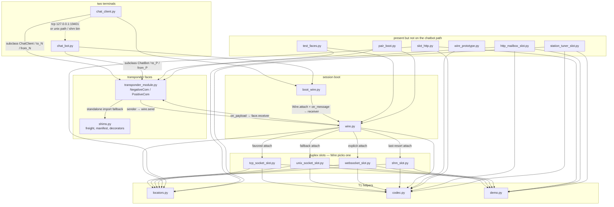

High-level map of `transponder_stack`. Solid arrows are imports. Dashed arrows are the live session the two terminals share.

Read it top to bottom as the product path: two short programs, one face module, one Wire, one live slot. The leftover box is real files in the directory that the chatbot terminals do not need to start.