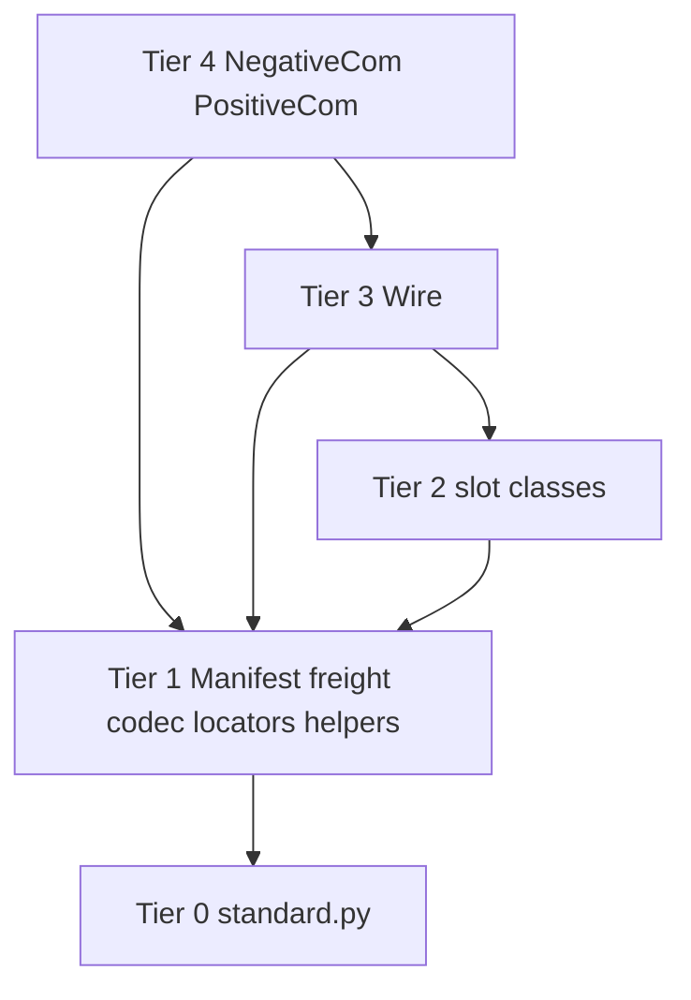

# Transponder → Prefix Handoff

Session-close note for integrating the working transponder stack into the
Communicators OS prefix (Genesis). This is not a spec freeze. It is the
state of the design at the end of the slot-prototype → Wire → faces →
two-terminal chatbot work, plus the prefix-tier decisions that followed.

Repo at time of writing:
`https://github.com/AnalysisLabs/communicators/tree/variant/staged/staged-2/communicators`

Pushed stack (already stripped of most demo files):
`Genesis/internal_imports/edge-methods/transponder_stack/`

Related law:
`Philosophy/Prefix_Tier_Principle.md`

Builder / transpiler:
`Genesis/Genesis_DB/prefix_builder.py`
`Genesis/Genesis_DB/prefix_transpiler.py`
`Genesis/Genesis_DB/dual_use_rectifier.py`

Current prefix builder tiers before this integration:
- Tier 0 — `standard.py` + `COMMUNICATORS_ROOT`
- Tier 1 — `path_reffs`, `atomic_importer`, Manifest (`freight` lives in `manifest.py` today)
- Tier 2 — old `transponder_module.py` blob
- Tier A — same as 2, then `transpile_to_tier_d`

Target after integration: **Tier 0 through Tier 4**, then Tier A as the
user-visible trim. Twelve tiers were anticipated; four is enough for this
system.

---

## 1. What was proven

Standalone slot programs were built and two-terminal tested first
(HTTP, TCP, WebSocket, Unix socket, SHM, station/tuner, HTTP mailbox).
JSON-framed distinctive messages. Then a `Wire` session layer. Then
`NegativeCom` / `PositiveCom` `sender` / `receiver` were pointed at Wire
instead of `UnixSocketClientSync` / `WSTamer`.

The acceptance test that actually matters is **not** the in-process
`test_faces.py` harness. It is two OS processes:

```text
terminal A:  python chat_bot.py
terminal B:  python chat_client.py --prompt "What is the weather on the packet strait?"
```

- Client sends one prompt with `to_N`.
- Bot receives it with `from_P`.
- Bot sends three freight replies with `to_P`, spaced **10 seconds**:
  impatient answer, title, summary.
- Client receives them with `from_N` on a persistent session.
- Client demo then exited after three replies. **That exit is demo-only.**
  Faces and Wire do not hang up after N messages. A production client
  stays attached until the process closes the Wire.

Default Wire row used in that run: **tcp**, fallback **unix**, last
resort **shm**. WebSocket was tested as an explicit scheme, not on the
default fallback row.

`WSTamer` and `UnixSocketClientSync` are obsolete for payload I/O.
Do not put them back in the stack. `unix_client` / `unix_server` /
`aux_multiton` decorators on the faces are leftover Genesis clothing;
keep only if the real prefix still defines them.

---

## 2. Intended runtime shape (Imago vs Metamorphosis)

Three levels, only two of which are prefix objects:

1. **Slots (Tier 2)** — one medium. Bind-or-connect, frame, `_write`,
   inbound hook. Production user code should not call these first.
2. **Wire (Tier 3)** — attach one slot, fallback at **attach time**,
   `send` dicts, deliver inbound to a callback. Used raw during
   **Metamorphosis** (talking to the namespace server).
3. **Faces (Tier 4)** — `NegativeCom` / `PositiveCom`. Queues, tokens,
   `to_N` / `from_N` / `to_P` / `from_P`, echo. **Imago** talks here.

Raw slots are allowed in development and as a discouraged hatch in user
programs. They skip fallbacks. Do not forbid them; do not advertise them
as the API.

Join recipe (`boot_wire.py` / `pair_boot.py`): construct Wire, `attach`,
hook `face.receiver`, `face.attach_wire`. That is **Metamorphosis glue**,
not a prefix module. Do not load those files. A later `connect()` on the
face, or metamorphosis code that already knows locators, replaces them.

---

## 3. Wire ↔ face contract

Keep `sender(self, ws, payload)` and `receiver(self, ws, message=None)`
signatures. Queue methods pass `ws`. Wire ignores `ws` as a medium.

```text
wire.attach(name=..., ref=..., on_message=lambda msg: face.receiver(wire, msg))
face.attach_wire(wire)          # sets self.wire, self.ws = wire
face.sender(...)  →  wire.send(dict)
slot inbound      →  on_payload → face.receiver
```

- `to_N` / `to_P` stay queue pumps. They already call `sender`.
- `from_N` / `from_P` stay application + protocol-echo hooks.
- `wait_for_echo` stays on the faces. Wire does not grow echo policy.
- Fallback is attach-time only. Do not walk tcp→unix mid-`send`.
- Illegal verbs (`send` on a tuner, etc.) raise `SlotRefused`.
- `communicator_token` stays in freight, above Wire. Do not collapse it
  with Wire `seq`.
- Positive `process_down_queue` only sends if the token is in
  `ws_token_dict` and the handle is in `connections`. Receiver must
  populate both. Chatbot replies must reuse the **prompt's** token.

Async: current slots and Wire are threaded blocking Python. Do not mark
them `async`. An asyncio face must `to_thread` if it calls `wire.send`.
Slot recv threads must not `await` face methods; current queues are
deque + flags.

### Echo deadlock that had to be fixed

`wait_for_echo` treated `{received: token}` as a single-use ticket.
`to_N`'s waiter and `process_up_queue`'s waiter after `from_N` both
needed the same token. One consumed it; the recv path stuck; only the
first chatbot reply landed.

Working pattern used in the stack:

- Protocol echoes (`{"received": token}`) set `echo_seen` and do **not**
  enter `up_queue` as application freight.
- `wait_for_echo` returns if the token is in `echo_seen` **without
  discarding** (both waiters can see it).
- `receiver` only queues application messages.
- A small daemon pump thread, started from `attach_wire`, calls
  `process_up_queue` so the slot recv thread does not block inside
  `wait_for_echo`.

When prefix-prepping the faces, keep that behavior or the two-process
chatbot test will regress.

---

## 4. Classes that survive vs demo-only

### Survive (prefix modules)

| Class today | File on GitHub now (approx) | Prefix module name |
|---|---|---|
| `Codec` | `codec.py` | `transponder_codec` |
| `Locators` | `transponder_locators.py` | `transponder_locators` |
| `SlotRefused` | `wire.py` | `transponder_slot_refused` |
| `DirWatch` | `shm_slot.py` | `transponder_dir_watch` |
| `UdpMail` | `station_tuner_slot.py` | `transponder_udp_mail` |
| `Mailbox` | `http_mailbox_slot.py` | `transponder_mailbox_bin` |
| `TcpSlot` | `tcp_socket_slot.py` | `transponder_tcp` |
| `UnixSlot` | `unix_socket_slot.py` | `transponder_unix` |
| `WsSlot` | `websocket_slot.py` | `transponder_ws` |
| `ShmSlot` | `shm_slot.py` | `transponder_shm` |
| `HttpSlot` | `http_slot.py` | `transponder_http` |
| `MailboxServer` | `http_mailbox_slot.py` | `transponder_mailbox_server` |
| `MailboxClient` | `http_mailbox_slot.py` | `transponder_mailbox_client` |
| `Station` | `station_tuner_slot.py` | `transponder_station` |
| `Tuner` | `station_tuner_slot.py` | `transponder_tuner` |
| `Wire` | `wire.py` | `transponder_wire` |
| `NegativeCom` | `transponder_module.py` | `transponder_negative` |
| `PositiveCom` | `transponder_module.py` | `transponder_positive` |

Also keep, but not a class today:

- `inject_echo_payload` — move onto a face (or a tiny helper class).
- `FEATURES` and `FALLBACK` — already conceptually Wire data; put them
  on `class Wire` so they are not module-level leaks.

Naming convention chosen: `transponder_*`, not a random suffix, not
`Edge.locators` (that spelling is invalid as a class name).
`class Edge.locators:` is a SyntaxError. Umbrella-as-attribute
(`Edge.locators = Locators`) was rejected in favor of the
`transponder_` prefix so user programs can call the hatch without
hogging short names like `Codec` or `TcpSlot`.

User-facing names after Tier A trim should still be the obvious ones:
`NegativeCom`, `PositiveCom`, `Wire`. The `transponder_*` spellings are
the discouraged-but-legal hatches.

### Demo only (do not prefix)

| Name | Why |
|---|---|
| `TcpCli`, `UnixCli`, `WsCli`, `ShmCli`, `HttpCli`, `MailboxCli`, `StationTunerCli` | two-terminal slot CLIs |
| `Demo` | SILLY / pulse lines |
| `ChatBot`, `ChatClient` | fake chatbot programs |
| `_Manifest`, `_Freight` and the rest of `shims.py` | stand-ins so the stack ran outside Genesis |
| `wire_prototype.py` / `wire_prototype(preserve_but_ignore).py` | stale duplicate; keep `wire.py` |
| `boot_wire.py`, `pair_boot.py` | demo join recipe; two files for one job |
| `test_faces.py` | in-process harness, not the success condition |
| `chat_bot.py`, `chat_client.py` | demo programs (keep in git history, not prefix) |

Standalone commits already exist if a runnable-on-disk version is
needed later. After prefix-prep, these modules are **not** valid
standalone programs. They are valid only inside the concatenated
prefix namespace.

---

## 5. Latest tier list (class = prefix module)

Tier 0 is reserved for third-party / `standard.py`. Nothing from this
stack goes there.

Place every class in the **lowest legal tier** given its dependencies.
Same-tier modules must not call each other.

### Tier 1 — only need Tier 0

Sit beside current Tier 1 (`Manifest`, `path_reffs`, `atomic_importer`).
Must not call Manifest. They don’t.

| Prefix module | Class | Why T1 |
|---|---|---|
| `transponder_codec` | `Codec` | json only |
| `transponder_locators` | `Locators` | string parse only |
| `transponder_slot_refused` | `SlotRefused` | `RuntimeError` subclass |
| `transponder_dir_watch` | `DirWatch` | inotify/libc |
| `transponder_udp_mail` | `UdpMail` | UDP bind helper |
| `transponder_mailbox_bin` | `Mailbox` | shared mailbox bin helper |

### Tier 2 — slots

Each may use Tier 1. None may use Wire or the faces. None may use
another Tier 2 name (`Station` must not import `Tuner`).

| Prefix module | Class | Tier 1 deps |
|---|---|---|
| `transponder_tcp` | `TcpSlot` | codec, locators |
| `transponder_unix` | `UnixSlot` | codec, locators |
| `transponder_ws` | `WsSlot` | codec, locators |
| `transponder_shm` | `ShmSlot` | codec, locators, dir_watch |
| `transponder_http` | `HttpSlot` | codec, locators |
| `transponder_mailbox_server` | `MailboxServer` | codec, locators, mailbox_bin |
| `transponder_mailbox_client` | `MailboxClient` | codec, locators, mailbox_bin |
| `transponder_station` | `Station` | codec, locators, udp_mail |
| `transponder_tuner` | `Tuner` | codec, locators, udp_mail |

HTTP / mailbox / station-tuner are the same height as tcp/unix/ws/shm.
`wire.py` today constructs tcp, unix, ws, shm. The others are real
slots for later fallback rows (WAN last-resort mailbox, heartbeat
station). They still belong in Tier 2 so Wire can grow without moving
tiers.

### Tier 3 — session

| Prefix module | Class | May use |
|---|---|---|
| `transponder_wire` | `Wire` | every T1 name + every T2 slot it is allowed to attach |

First class that must see more than one slot. Cannot sit in Tier 2.

Default fallback table (loopback scope), as implemented:

```text
tcp → unix → shm
```

Earlier design notes also sketched WAN: tcp → websocket → http, and a
future HTTP-mailbox last resort. Those rows live on `Wire.FALLBACK` by
scope (`loopback` / `lan` / `wan`), not in the slots.

### Tier 4 — faces

| Prefix module | Class | May use |
|---|---|---|
| `transponder_negative` | `NegativeCom` | Wire by **injection**, Manifest/freight (T1) |
| `transponder_positive` | `PositiveCom` | same |

No `from transponder_wire import Wire` required if `attach_wire`
remains the join. A real import is legal T4 → T3 if you add one later.

### Builder emit order

```text
T0  standard.py
T1  Manifest, path_reffs, atomic_importer,
    transponder_codec, transponder_locators, transponder_slot_refused,
    transponder_dir_watch, transponder_udp_mail, transponder_mailbox_bin
T2  transponder_{tcp,unix,ws,shm,http,mailbox_server,mailbox_client,station,tuner}
T3  transponder_wire
T4  transponder_negative, transponder_positive
TA  transpile + trim to public names
```

There is **no cycle** among keepers. Wire does not import faces. Faces
do not import Wire at module load. Slots do not import other slots.
`UdpMail` / `DirWatch` / `Mailbox` were pulled down to T1 so Station /
ShmSlot / MailboxServer can stay T2 without same-tier calls.

`@modulemethod` is **not** required for this graph. Do not add it just
to flatten Wire into the slot tier. The only future use that would earn
the marker is “this identifier was cut out of my file into a sibling
prefix module” (`UdpMail` used to live next to `Station`). That is a
cut/concat concern, not Stage C.

---

## 6. How prefix loading actually works (do not mythologize it)

The builder reads source via `FileRef` / VirtualFS and **concatenates**
tier strings. It does not `import` stack files as packages at user
runtime. After a lower tier has executed, its public names are globals
in the same namespace.

Transpiler stages (`prefix_transpiler.py`):

| Stage | Job |
|---|---|
| B | Split one class into `Name_internal` / `Name` from `@internalmethod` / `@externalmethod` / `@dualmethod` |
| C | Qualify calls **inside that split** (`_Name_internal.foo()` vs `self.foo()`), inject `self` |
| D | Collapse extra blank lines |

Stage C does **not** rewrite cross-module imports. It does not discover
that Wire needs `TcpSlot`. It does not fix a file placed in the wrong
tier. Dependency direction must already be correct in the source you
hand the builder.

`dual_use_rectifier.py` wraps a pile of free functions into one class
with those markers. Needed for old `path_reffs` / `atomic_importer`.
**Not** needed for Codec, slots, Wire, or faces — they are already
classes. Do not wrap them in a second outer class.

### On-disk vs prefix namespace

Two truths that fight:

1. Prefix runtime wants bare names and no peer imports (one namespace).
2. Repo files want real imports so humans can read them.

Decision for prep: after you are done, files need **not** be standalone.
Still write **legal lower-tier names** in the bodies
(`Codec.encode_msg`, `Locators.parse_hostport`). Strip or delete
`from codec import Codec` style lines as part of prefix-prep, because
those packages will not exist in the user program.

Do not write `from .state import freight` into the prefix string.
`freight` / `manifest` should already be T1 globals. The
`from .state import ...` line in today’s `transponder_module.py` is a
disk fiction from the old package layout.

Same-tier calls stay forbidden even after concat. Concatenation does
not make `Station` calling `Tuner` legal under the principle.

### Explicit vs automatic load of ~20 modules

Day-one recommendation:

- **Explicit membership** — a table of `(tier, source_file, class_name, prefix_name)` is the law.
- **Automate extraction + concat later** — cutter emits one class body, drops `*Cli` / `__main__`, strips peer imports.
- Do **not** scan the directory and take everything (`ChatBot` would sneak in).
- Do **not** automate the rectifier.

Special-case list should stay short:

| Exception | Treatment |
|---|---|
| Rectifier targets | only old Genesis free-function files |
| `FEATURES` / `FALLBACK` / `inject_echo_payload` | move onto a class, then normal load |
| Multi-class slot files | cut by class name into one prefix module each |
| Peer `import` lines | strip at concat |
| `*Cli` / `__main__` | drop |
| Wire → faces | injection, not import |

Clerical cost of explicit FileRefs is real and boring. Architectural
cost is not. First integration can be manual FileRefs in
`build_prefix1`…`build_prefix4`. Automate after the table is stable.

---

## 7. `standard.py` (Tier 0) additions

Slots used stdlib modules that were not in `standard.py`. Add these if
the prefix-bound bodies still reference them as bare imports. Suggested
block (matches existing style):

```python
from __future__ import annotations
import argparse, ast, asyncio, ctypes, fcntl, hashlib, httpx, inspect, json, math, numpy, os, random, re, requests, secrets, select, shutil, signal, sqlite3, socket, stat, struct, subprocess, sys, tempfile, threading, time, traceback, tracemalloc, urllib, uuid, websockets, yaml
from aiohttp import web
from collections import deque, Counter
from ctypes import util as ctypes_util
from dataclasses import dataclass
from datetime import datetime, timezone
from functools import lru_cache
from http.server import BaseHTTPRequestHandler, HTTPServer
import importlib.util
from importlib.abc import SourceLoader
from pathlib import Path
from scipy.stats import norm
from types import SimpleNamespace, ModuleType
from typing import Any, Dict, Iterable, Optional, Sequence
from urllib.error import HTTPError, URLError
from urllib.parse import urlparse
from urllib.request import Request, urlopen
from weakref import WeakValueDictionary
from websockets.sync.server import serve
```

Why the extra `from` lines:

- `import urllib` does not bind `urllib.request` until that submodule
  is imported. HTTP slots used `urllib.request.urlopen`.
- `import ctypes` does not bind `ctypes.util`. `DirWatch` needs
  `find_library`.
- `fcntl`, `select`, `stat` are used as modules; the big `import` line
  is enough.

Do **not** add `state` or `unix_socket` to `standard.py`. Those are
Genesis names, not third-party.

`websockets` and `http.server` were already in `standard.py`.

---

## 8. Slot media notes (so Wire does not re-learn them)

| Slot | Locator | Topology | Framing |
|---|---|---|---|
| TCP | `host:port` shared | first bind listens, other connects | NDJSON |
| Unix | filesystem path | same bind-or-connect | NDJSON |
| WebSocket | `host:port` | same | JSON text frames |
| SHM | one token per endpoint, **one shared bin**, two lanes (queues) | inotify / file ops, no socket | JSON object in `/dev/shm` |
| HTTP | two `host:port` pairs historically | request/response | JSON body |
| HTTP mailbox | HTTP + shm-like bin | asymmetric server/client | JSON |
| Station / Tuner | UDP unicast + join registry | station fans out, ignores payload from tuners beyond registry | datagram JSON |

SHM: each endpoint creates the bin if missing. Lanes are a two-way
street. Tokens can be hex. “Passive” means event-driven (`DirWatch`),
not a poll loop.

Station/tuner (renamed from beacon): station does not care whether
anyone received the packet. Tuner problem. Not multicast in the
implemented compromise — UDP unicast to the registered list.

Capability / `SlotRefused`: asking a tuner to `send` like a duplex
session, or a station to `recv` a reply, should raise rather than hang.

Inbound hook added on duplex slots: `on_payload`. If the message is not
`kind in {chat, reply, hello}`, the hook runs and the old demo
auto-reply is skipped. Freight uses `kind` values like `prompt` /
`bot_reply` / `freight`.

---

## 9. Control flow (high level)

```text
chat_client / metamorphosis / user
        │  to_N
        ▼
NegativeCom  ──sender──►  Wire.send  ──_write──►  live slot
                                                  (tcp/unix/ws/shm/…)
PositiveCom  ◄─receiver◄─  on_payload ◄── recv loop
        │  from_P
        │  to_P  (same token)
        ▼
Wire.send again on the same attached session
```

`boot_wire` / `pair_boot` only exist to perform attach + hook. After
prefix integration that rectangle is Metamorphosis or `attach_wire`
called from a face `connect()`.

---

## 10. GitHub tree vs older sandbox tree

At the end of the session GitHub `transponder_stack/` contained
approximately:

```text
codec.py
transponder_locators.py
http_slot.py
http_mailbox_slot.py
shm_slot.py
station_tuner_slot.py
tcp_socket_slot.py
unix_socket_slot.py
websocket_slot.py
wire.py
transponder_module.py
wire_prototype(preserve_but_ignore).py
```

Demo files had already been dropped from that folder. Older sandbox
copies under `/home/workdir/artifacts/transponder_stack/` may still
have `chat_*.py`, `boot_wire.py`, `pair_boot.py`, `shims.py`, `demo.py`.
Treat GitHub as the record; treat those extras as history.

`Genesis/internal_imports/edge-methods/connections/` still has
`unix_socket.py` and `ws_tamer.py`. Payload path must not go back
through them. Decorators only, if at all.

`Genesis/internal_imports/transponder_module.py` is the old prefix blob
location. The stack copy is the one that was iterated against Wire.
Reconcile those two files before the builder points at one FileRef.

---

## 11. Suggested work for the next session (manual first)

1. Finish prefix-prep of each surviving class: no `*Cli`, no `__main__`,
   no `Demo`, no peer package imports, `FEATURES`/`FALLBACK` on `Wire`,
   `inject_echo_payload` on a class.
2. Split multi-class files into one class per prefix module (or mark
   cut points the builder can slice). `station_tuner_slot.py` →
   `UdpMail` (T1) + `Station` + `Tuner` (T2). Same idea for mailbox
   and shm.
3. Add the stdlib imports to `standard.py` if the bodies still need
   them as names.
4. Extend `prefix_builder.py` with `build_prefix3` / `build_prefix4`
   (or reuse numbers: current T2 blob becomes T4 faces; insert codec/
   slots/wire under new T1 appendices + T2 + T3). Update
   `Prefix_Tier_Principle.md` fictitious illustration if it still
   shows only T0–T2.
5. FileRefs + registry UUIDs for each prefix module. Explicit is fine.
6. Confirm faces still: populate `ws_token_dict` / `connections` on
   receive; reuse communicator_token on `to_P`; echo_seen without
   discard; up-queue pump off the recv thread.
7. Re-run the two-process chatbot test **against a prefix-built
   program**, not against `chat_*.py` as standalone files. That is the
   integration bar.
8. Only then automate the cutter / concat table.

Do not start a runtime generation pipeline that assembles
`transponder_module.py` from slots at user start. Concatenate at
Genesis prefix-build time. Do not nest the prefix into a deep package
tree just to keep slots as files; the builder already flattens them.

---

## 12. Decisions already made (do not re-litigate unless the graph changes)

- Not maximally DRY. Shared encode/decode lives on `Codec`. Framing
  stays on the slot. Attach policy stays on the slot. Fallback tables
  stay on `Wire`.
- Slots remain separate on-disk files; Wire and faces remain separate
  classes. One giant `transponder_module.py` is not the goal.
- Tiers, not `@modulemethod`, for Station vs Tuner vs UdpMail.
- `transponder_` name prefix, not random permanent numbers, not
  `Edge.foo` as a class identifier.
- User may call raw slots; production should call Wire / faces.
- Wire is used alone in Metamorphosis; Imago prefers faces.
- Stage C is the wrong place to encode cross-module dependencies.
- `pair_boot.py` is not a transponder layer. Neither is `boot_wire.py`.
- Client closing after three replies is demo behavior.

---

## 13. Quick mermaid of prefix objects only



Injection arrow T4 → T3 is `attach_wire`, not an import.

---

End of handoff. Next session should assume this document plus the
GitHub `transponder_stack/` tree, not the earlier in-process-only
`test_faces.py` story.
