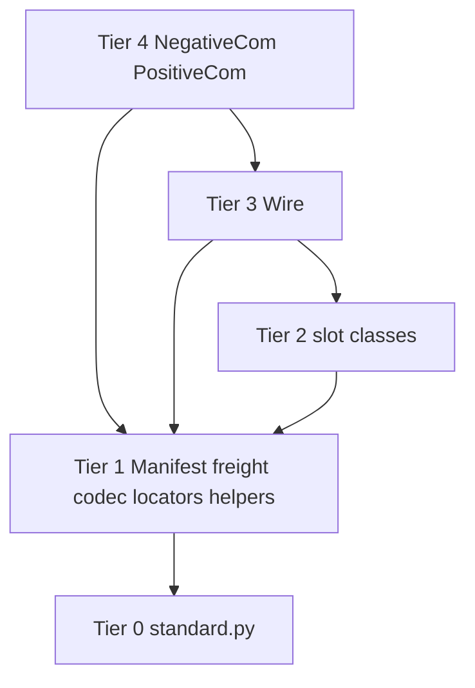

# Transponder → Prefix Handoff (2)

Session-close note after the prefix-prep pass on
`transponder_stack/` and before automating prefix load.

This replaces, not appends to, the first handoff for *current file
state*. The original remains useful as history of why the graph looks
like this.

Repo:
`https://github.com/AnalysisLabs/communicators/tree/variant/staged/staged-2/communicators`

Stack that the builder must point at:
`Genesis/internal_imports/edge-methods/transponder_stack/`

Do **not** point the builder at:
- `Genesis/internal_imports/transponder_module.py` (old blob, still
  `from .state import …` / `WSTamer`)
- `Genesis/internal_imports/edge-methods/Slots/` (older on-disk
  prototypes; registered only so the tree is complete)

Related law: `Philosophy/Prefix_Tier_Principle.md`

Builder / transpiler (unchanged location):
- `Genesis/Genesis_DB/prefix_builder.py` — still T0 / T1 / T2-old-blob / TA
- `Genesis/Genesis_DB/prefix_transpiler.py`
- `Genesis/Genesis_DB/dual_use_rectifier.py` — **not** for this stack

---

## 0. What this session actually did

Done on the stack files themselves:

1. Every direct class member has exactly one of
   `@internalmethod` / `@externalmethod` / `@dualmethod`.
   Editor: `decorate_transponder_markers.py` (throwaway; already run).
2. Peer package imports stripped (`from codec import Codec`,
   `from locators import Locators`, slot-to-slot imports, `from demo`).
3. Cross-class calls rewritten to the **defined class identifier**:
   `Transponder_Codec.*`, `Transponder_Locators.*`, `TcpSlot(...)`,
   `Wire.FEATURES`, `Wire.FALLBACK`.
   Editor: `edge-methods/fix_transponder_names.py` (committed; already run).
4. `Demo.silly_for` / `Demo.pulse_text` removed. `burst()` is `pass`.
5. Module-level `encode_msg = Codec.encode_msg` aliases deleted from
   `codec.py`.
6. `FEATURES` / `FALLBACK` already live on `class Wire`.
7. `inject_echo_payload` lives on each face as a `@dualmethod`
   (required: it is the decorator on `echo`).
8. File-registry UUIDs minted for the new `edge-methods` paths
   (see §9). Existing UUIDs were not recycled.

Files are no longer standalone programs. That is intended.

---

## 1. Known leftovers on the stack (fix with the first concat, not a new philosophy pass)

These will `NameError` or miss a rename if ignored:

| Item | Where | What to do |
|---|---|---|
| One missed rename | `station_tuner_slot.py` JOIN print still says `Locators.fmt_addr(dest)` | `Transponder_Locators.fmt_addr` |
| Face clothing | `transponder_module.py`: `@unix_client`, `@unix_server`, `@aux_multiton`, `generate_unique_socket_path()`, `truncate(500, …)` | Strip, or define no-op/real T1 names. Do **not** route payload I/O back through `UnixSocketClientSync` / `WSTamer`. |
| T0 holes in `standard.py` | `sellect` typo (must be `select`); no bare `ThreadingHTTPServer`; `DirWatch` calls `ctypes.util.find_library` while T0 binds `ctypes_util` | Fix T0 to match bodies, or edit bodies to the T0 names. |
| Two face files | Builder FileRef `0f589da7-…` still names the **old** `Genesis/internal_imports/transponder_module.py` | Retarget to stack copy `b03e35ee-…`. Do not merge the old blob forward. |
| Stage B vs instances | Markers are on the classes. Stage B still emits `_Name_internal = Name_internal()` and turns public methods into `@staticmethod`. | First loader **concatenates**. Do not run Stage B on slots / Wire / faces until constructors are special-cased. Markers can sit unused. |

`wire_prototype(preserve_but_ignore).py` stays in the folder. Explicit
membership table must omit it.

---

## 2. Runtime shape (unchanged)

Three levels, only two of which are prefix objects:

1. **Slots (Tier 2)** — one medium. Bind-or-connect, frame, `_write`,
   inbound `on_payload`. Hatch, not the advertised API.
2. **Wire (Tier 3)** — attach one slot, fallback at **attach time**,
   `send` dicts, inbound callback. Metamorphosis talks here.
3. **Faces (Tier 4)** — `NegativeCom` / `PositiveCom`. Queues, tokens,
   `to_N` / `from_N` / `to_P` / `from_P`, echo. Imago talks here.

Join is injection, not import:

```text
wire.attach(name=..., ref=..., on_message=lambda msg: face.receiver(wire, msg))
face.attach_wire(wire)          # self.wire = self.ws = wire
face.sender(...)  →  wire.send(dict)
slot inbound      →  on_payload → face.receiver
```

Fallback is attach-time only. `communicator_token` stays in freight.
Echo contract that must not regress:

- `{"received": token}` sets `echo_seen`, does not enter `up_queue`.
- `wait_for_echo` returns if the token is in `echo_seen` **without
  discarding**.
- `receiver` only queues application messages.
- Daemon pump from `attach_wire` runs `process_up_queue` off the
  recv thread.
- Positive replies reuse the prompt’s token; receiver fills
  `ws_token_dict` and `connections`.

Acceptance test is still two OS processes against a **prefix-built**
program, not `chat_*.py` and not `test_faces.py`. Default Wire row:
tcp → unix → shm.

---

## 3. Class names as they exist on disk now

Bodies use the **class identifier**. Short names (`Codec`, `Locators`)
are Tier A aliases later, not current call-site spellings.

| Class on disk          | File                      | Prefix module name           | Tier |
| ---------------------- | ------------------------- | ---------------------------- | ---- |
| `Transponder_Codec`    | `codec.py`                | `transponder_codec`          | 1    |
| `Transponder_Locators` | `transponder_locators.py` | `transponder_locators`       | 1    |
| `SlotRefused`          | `wire.py`                 | `transponder_slot_refused`   | 1    |
| `DirWatch`             | `shm_slot.py`             | `transponder_dir_watch`      | 1    |
| `UdpMail`              | `station_tuner_slot.py`   | `transponder_udp_mail`       | 1    |
| `Mailbox`              | `http_mailbox_slot.py`    | `transponder_mailbox_bin`    | 1    |
| `TcpSlot`              | `tcp_socket_slot.py`      | `transponder_tcp`            | 2    |
| `UnixSlot`             | `unix_socket_slot.py`     | `transponder_unix`           | 2    |
| `WsSlot`               | `websocket_slot.py`       | `transponder_ws`             | 2    |
| `ShmSlot`              | `shm_slot.py`             | `transponder_shm`            | 2    |
| `HttpSlot`             | `http_slot.py`            | `transponder_http`           | 2    |
| `MailboxServer`        | `http_mailbox_slot.py`    | `transponder_mailbox_server` | 2    |
| `MailboxClient`        | `http_mailbox_slot.py`    | `transponder_mailbox_client` | 2    |
| `Station`              | `station_tuner_slot.py`   | `transponder_station`        | 2    |
| `Tuner`                | `station_tuner_slot.py`   | `transponder_tuner`          | 2    |
| `Wire`                 | `wire.py`                 | `transponder_wire`           | 3    |
| `NegativeCom`          | `transponder_module.py`   | `transponder_negative`       | 4    |
| `PositiveCom`          | `transponder_module.py`   | `transponder_positive`       | 4    |

User-visible after Tier A trim: `NegativeCom`, `PositiveCom`, `Wire`.
Optional short aliases: `Codec`, `Locators`, `TcpSlot`, ….
`transponder_*` remains the hatch spelling for the *module* row, not a
second class identifier.

Same-tier modules must not call each other. `UdpMail` / `DirWatch` /
`Mailbox` sit in T1 so Station / ShmSlot / MailboxServer can stay T2.
Wire is the first type that sees more than one slot, so it cannot be T2.

Do not prefix: `*Cli`, `Demo`, `ChatBot`, `ChatClient`, shims,
`boot_wire.py`, `pair_boot.py`, `test_faces.py`, either wire prototype.

---

## 4. Membership table (the law for the loader)

Explicit. No directory scan. One row per prefix module. Multi-class
files are cut by class name at concat time (do not require an on-disk
split first).

```text
tier  source_file                  class_name             prefix_name                   file_uuid
1     codec.py                     Transponder_Codec      transponder_codec             37dd39db-1e88-462b-99d0-46c1c32f6043
1     transponder_locators.py      Transponder_Locators   transponder_locators          9f3c5396-193c-4951-a47a-929cbc60d82c
1     wire.py                      SlotRefused            transponder_slot_refused      af110108-d8d7-4c51-bffd-0723879bbf09
1     shm_slot.py                  DirWatch               transponder_dir_watch         8df05483-984e-4e81-bf90-6b4f994f1987
1     station_tuner_slot.py        UdpMail                transponder_udp_mail          d198072a-2724-4986-a7f9-11de64b26623
1     http_mailbox_slot.py         Mailbox                transponder_mailbox_bin       7235367f-2b5d-4999-ba7b-859f913c5492
2     tcp_socket_slot.py           TcpSlot                transponder_tcp               e622891d-6396-4f0c-a038-2cbc5d119fad
2     unix_socket_slot.py          UnixSlot               transponder_unix              3d2e0925-4f99-4440-b55c-ca4b116c5d64
2     websocket_slot.py            WsSlot                 transponder_ws                c5ab9ec7-19c6-4786-b997-90d0a050b96e
2     shm_slot.py                  ShmSlot                transponder_shm               8df05483-984e-4e81-bf90-6b4f994f1987
2     http_slot.py                 HttpSlot               transponder_http              503640a9-f085-406d-8837-ac5b0208a1f3
2     http_mailbox_slot.py         MailboxServer          transponder_mailbox_server    7235367f-2b5d-4999-ba7b-859f913c5492
2     http_mailbox_slot.py         MailboxClient          transponder_mailbox_client    7235367f-2b5d-4999-ba7b-859f913c5492
2     station_tuner_slot.py        Station                transponder_station           d198072a-2724-4986-a7f9-11de64b26623
2     station_tuner_slot.py        Tuner                  transponder_tuner             d198072a-2724-4986-a7f9-11de64b26623
3     wire.py                      Wire                   transponder_wire              af110108-d8d7-4c51-bffd-0723879bbf09
4     transponder_module.py        NegativeCom            transponder_negative          b03e35ee-e03c-4eef-beec-a965790a1708
4     transponder_module.py        PositiveCom            transponder_positive          b03e35ee-e03c-4eef-beec-a965790a1708
```

All `file_path` values are
`Genesis/internal_imports/edge-methods/transponder_stack`.

Directory UUID for the folder itself: `eff04379-47d1-4c04-bdf2-e0a12a0abf63`.

Existing T0 / T1 FileRefs to keep:

| Name | UUID | Path |
|---|---|---|
| `standard.py` | `8090dc7b-4a91-448d-8ab0-0b5acfbb5dee` | `Genesis/internal_imports` |
| `manifest.py` | `64bf54d1-e607-4bfc-b6ba-73ccc2748dd4` | `Genesis/internal_imports` |
| `path_reffs.py` | `e77217a6-2fb1-4837-925b-312a70874ae5` | `Genesis/internal_imports` |
| `atomic_importer.py` | `6c2d43c5-1a1f-4cd5-b41e-7ba2523604ff` | `Genesis/internal_imports` |
| `prefix_builder.py` | `d97229e0-f3f3-46ac-9db4-a94e84b3a43c` | `Genesis/Genesis_DB` |
| `prefix_transpiler.py` | `c3c395ae-368a-4844-91d8-0d3d69b3eae5` | `Genesis/Genesis_DB` |

Old blob, do not load as T2 any more:

| Name | UUID | Path |
|---|---|---|
| `transponder_module.py` (old) | `0f589da7-ebcc-4ef1-a44c-59111c1d1a9a` | `Genesis/internal_imports` |

---

## 5. Builder emit order (target)

```text
T0  standard.py + COMMUNICATORS_ROOT
T1  PathReffs, AtomicImporter, Manifest,
    transponder_codec, transponder_locators, transponder_slot_refused,
    transponder_dir_watch, transponder_udp_mail, transponder_mailbox_bin
T2  transponder_{tcp,unix,ws,shm,http,mailbox_server,mailbox_client,station,tuner}
T3  transponder_wire
T4  transponder_negative, transponder_positive
TA  (later) transpile + trim to public names
```

Current builder is still:

```text
T0  standard.py
T1  path_reffs + atomic_importer + Manifest
T2  old transponder_module.py blob
TA  T2 then transpile_to_tier_d
```

First integration: add `build_prefix1` appendices + `build_prefix2` /
`build_prefix3` / `build_prefix4`. Reuse numbers if you want the old T2
slot to become T4 faces; either way the old blob drops out of the
emit list.

Cutter job per row:

- Read source via FileRef / VirtualFS.
- Extract **one** top-level class body by name (AST line ranges, same
  contract as the transpiler: AST for numbers, mutate source lines).
- Drop `*Cli`, `__main__`, leftover peer imports if any survive.
- Do not wrap in another outer class.
- Do not run the rectifier.
- Do not run Stage B on this graph yet.

Concatenation is build-time. Do not assemble `transponder_module.py`
from slots at user start.

---

## 6. How prefix loading actually works (still true)

The builder concatenates tier strings. After a lower tier executes,
its public names are globals in the same namespace. There is no
`import transponder_tcp` at user runtime.

Stage C does not discover that Wire needs `TcpSlot`. Dependency
direction must already be correct — it is, if you emit in the table
order and keep bodies spelling `Transponder_Codec.encode_msg` /
`TcpSlot(...)`.

`freight` / `manifest` are already T1 globals. Faces already call them
bare. Do not write `from .state import freight` into the prefix string.

---

## 7. T0 names the stack still needs as bare identifiers

Already in `standard.py` in some form: `json`, `os`, `re`, `socket`,
`threading`, `time`, `ctypes`, `fcntl`, `struct`, `uuid`, `urllib.request`,
`BaseHTTPRequestHandler`, `HTTPServer`, `deque`, `websockets.sync.server.serve`,
`websockets.sync.client.connect`.

Must still be made true:

- `select` (fix `sellect`)
- `ThreadingHTTPServer` (http slots use the bare name)
- `ctypes.util.find_library` **or** change `DirWatch` to `ctypes_util.find_library`
- `Union` / `Any` (codec uses them; T0 already imports from `typing`)

Do not add `state`, `unix_socket`, `WSTamer` to T0.

---

## 8. Decisions already made (do not re-litigate)

- Not maximally DRY. Codec / framing / attach / fallback stay on the
  types that own them.
- Tiers, not `@modulemethod`, for Station vs Tuner vs UdpMail.
- `transponder_*` is the prefix-module spelling. Class identifiers on
  disk are `Transponder_Codec`, `Transponder_Locators`, `TcpSlot`, …
- Production calls Wire / faces. Raw slots are a legal hatch.
- Wire alone in Metamorphosis; Imago prefers faces.
- `pair_boot.py` / `boot_wire.py` are not prefix modules.
- Markers exist so Stage B *can* run later. They are not a reason to
  split stateful types in the first concat.
- Client exit after three replies is demo-only.

---

## 9. Edge-methods registry delta (already minted)

Keep every pre-existing edge-methods UUID. New rows:

| UUID | file_path | file_name |
|---|---|---|
| `c6daacba-edef-40b5-bf0b-43e9105d83f1` | `Genesis/internal_imports/edge-methods` | `fix_transponder_names.py` |
| `03b40c3b-aebb-4b9d-aa3a-261597e76120` | `Genesis/internal_imports/edge-methods` | `graph-methods.md` |
| `f2ad0a64-00b7-4658-90e2-2363e8768c1a` | `Genesis/internal_imports/edge-methods` | `transponder graph.md` |
| `2ee08546-eb17-4257-95bc-b352e83e27d9` | `Genesis/internal_imports/edge-methods/connections` | `transponder.md` |
| `680884eb-763f-4907-879d-4d9c909c1ded` | `Genesis/internal_imports/edge-methods` | `Slots` |
| `eff04379-47d1-4c04-bdf2-e0a12a0abf63` | `Genesis/internal_imports/edge-methods` | `transponder_stack` |
| plus one UUID per file under `Slots/` and `transponder_stack/` as listed in the previous chat turn |

`core.py` UUID `00e97bdc-…` is unchanged; that file is in the registry
and not on the current GitHub tree. Leave it.

---

## 10. Work for the next session (this is the session)

1. Land the membership table in `prefix_builder.py` as data, not as
   a directory walk.
2. Cutter: given `(source, class_name)` emit one class body.
3. `build_prefix1`…`build_prefix4` using that table. Drop the old T2
   blob from the emit list.
4. Fix the four leftovers in §1 and the T0 holes in §7 so the first
   concat executes.
5. Confirm faces still honor the echo / token / pump contract after
   clothing is stripped.
6. Only after a prefix-built two-process chat works: automate further,
   consider Stage B, consider Tier A trim, update
   `Prefix_Tier_Principle.md` if it still draws only T0–T2.

Do not start a runtime assembler. Do not wrap these classes in a
second outer class. Do not load `Slots/` or the wire prototype.



T4 → T3 is `attach_wire`, not an import.
