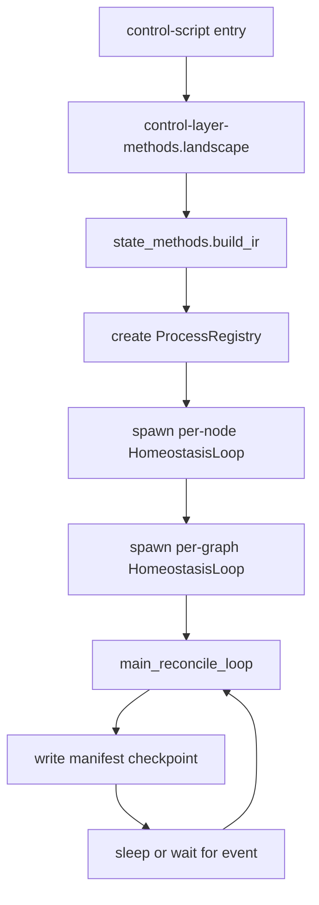

# Control Script — Bootstrap, YAML Load, IR, Homeostasis Loops, Self-Healing Gate

**Specialized Design Document for `communicators/control-script/`**

## Purpose
The `control-script` directory (and its `main.py` or `orchestrator.py` entry point) is the **thin, executable front door** to the entire system. It performs the absolute minimum work required to:
1. Load the desired state from YAML
2. Convert it into the validated Intermediate Representation (IR)
3. Instantiate per-node and per-graph homeostasis loops
4. Enter the main reconciliation loop that never raises — only heals or halts with manifest explanation

It embodies the **"Thin Bootstrap / Launcher Layer"** and **"Reconciliation Loop as the Heart"** principles.

## Execution Flow (High Level)



  

- **A (control-script entry)**: This is the starting point where the control script begins execution, typically invoked from the command line or a wrapper script, initializing the entire orchestration process by setting up the environment and kicking off the prelude setup.

- **B (prelude.landscape)**: Here, the system performs initial setup tasks, such as importing necessary modules, loading environment variables, configuring logging, and preparing shared resources like manifest file descriptors or signal handlers, ensuring a clean foundation for the rest of the script.

- **C (IdealState.from_yaml)**: The desired state of the system is loaded from a YAML configuration file, parsing it into an internal representation that defines the graph of nodes, their dependencies, configurations, and other declarative settings without yet validating or executing anything.

- **D (state_methods.build_ir)**: The loaded ideal state is transformed into a validated Intermediate Representation (IR), which checks for errors like cycles, unresolved node types, or invalid configurations, normalizing the data into a format ready for instantiation and reconciliation.

- **E (create ProcessRegistry)**: A centralized registry is instantiated to track all running processes, nodes, and their states, providing a queryable inventory for monitoring health, managing lifecycles, and supporting operations like restarts or status checks.

- **F (spawn per-node HomeostasisLoop)**: Individual homeostasis loops are created and started for each node in the graph; each loop is a lightweight thread or task dedicated to monitoring and reconciling the state of its specific node, handling tasks like health checks and self-healing without interfering with others.

- **G (spawn per-graph HomeostasisLoop)**: Similarly, a homeostasis loop is spawned for the overall graph, overseeing high-level coordination, dependencies between nodes, and global state reconciliation to ensure the entire system aligns with the ideal state.

- **H (main_reconcile_loop)**: This enters the core reconciliation loop, where the system continuously compares the ideal state against the real state, computes differences, and executes actions (like starting, stopping, or restarting nodes) to drive convergence, while integrating healing strategies for any detected issues.

- **I (write manifest checkpoint)**: Every significant event, state change, or action taken during reconciliation is logged to the manifest in chronological order, creating a timestamped, queryable record for observability, debugging, and auditing purposes.

- **J (sleep or wait for event)**: The system pauses briefly, either sleeping for a configured interval or waiting for external events (like signals or notifications), allowing resources to rest before resuming the loop, ensuring efficient operation without constant polling.

## Core Responsibilities

### 1. YAML Loading & Validation
```python
from communicators.state_methods import IdealState
from communicators.ffiir import build_ir

ideal = IdealState.from_yaml(sys.argv[1] if len(sys.argv) > 1 else "desired-state.yaml")
ir = build_ir(ideal)   # validated, normalized, ready for execution
```

### 2. Homeostasis Loop Factory
Each node and each graph gets its own lightweight loop (thread or `asyncio` task) that owns **only** its own slice of reality:

```python
def create_homeostasis_loop(target: NodeInstance | Graph) -> HomeostasisLoop:
    return HomeostasisLoop(
        target=target,
        ideal=ideal,
        real=RealState(registry),
        healing_tree=control_layer_methods.healing_tree,
        manifest=ManifestLogger(target.id)
    )
```

The loop body is always the same:
```python
while running:
    try:
        target.reconcile()          # or node.check_health()
    except Exception as e:
        healing_tree.handle(e)      # never raises
    manifest.checkpoint()
    event.wait(timeout=ideal.health_interval)
```

### 3. Self-Healing Gate
The script refuses to start (or halts cleanly) if:
- YAML is invalid
- IR contains cycles or unknown node types
- Required manifest directory is unwritable
- Another orchestrator instance is already running (PID file + `kill -0` check)

All such gate failures produce a single, categorized manifest line before `sys.exit(1)`.

### 4. Signal Handling
Installed once at startup:
- `SIGTERM` → graceful shutdown of entire graph + manifest final checkpoint
- `SIGHUP` → reload YAML (future hot-reload, currently restarts the process)
- `SIGINT` (Ctrl-C) → same as SIGTERM but with shorter timeout

## Thin Bootstrap (actual `control-script` file)
The real executable is a minimal Bash script:

```bash
#!/usr/bin/env bash
set -euo pipefail
source /opt/communicators/lib/prelude.sh
export COMMUNICATORS_MANIFEST_FD=3
exec python -m communicators.control_script.main "$@"
```

All intelligence lives in the Python `main.py` inside this directory.

## Design Decisions

- **One control script per graph** — Multiple independent orchestrators can run on the same machine (different manifest paths, different socket namespaces).
- **IR is the hand-off point** — After `build_ir`, the control script never touches raw YAML again. All downstream code works on the clean IR.
- **Per-entity homeostasis** — A single global loop would be simpler but harder to debug and less scalable when graphs become large. Small per-node loops make the manifest perfectly chronological and easy to filter.
- **No daemonization inside the script** — The thin Bash wrapper or systemd unit is responsible for daemonization. The Python code assumes it is the foreground process.

## Example Startup
```bash
./control-script desired-lab-graph.yaml
# or via systemd
systemctl start communicators@lab-orchestration-01
```

The first lines in the manifest are always:
```
2026-04-27T13:54:12.000Z [control-script] INFO: Ideal state loaded from desired-lab-graph.yaml (42 nodes, 7 primaries)
2026-04-27T13:54:12.010Z [control-script] INFO: IR validated — no cycles, all node types resolvable
2026-04-27T13:54:12.050Z [control-script] INFO: Homeostasis loops started for 42 nodes + 1 graph
```

## Benefits
- Extremely small attack surface for the bootstrap.
- Every run produces an identical, reproducible startup sequence in the manifest.
- Easy to wrap in containers, systemd, or even a one-line `python -m` invocation for development.

## Open Questions
- Hot-reload of YAML without full process restart (via SIGHUP + IR diff)?
- Built-in support for "blue/green" graph swaps (load new YAML beside running one, then atomically switch)?
- Integration with watchdog / systemd Type=notify for even tighter process supervision?
